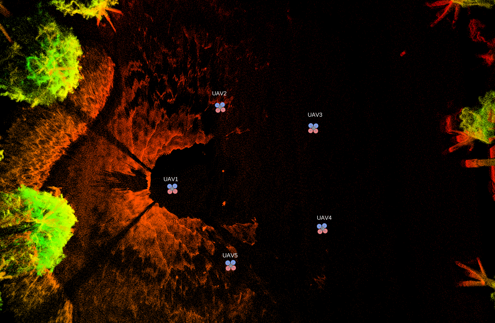

# Swarm-LIO2

## Swarm-LIO2: Decentralized, Effcient LiDAR-inertial Odometry for UAV Swarms

### Introduction

**Swarm-LIO2** is a fully decentralized, plug-and-play, computationally efficient, and bandwidth-efficient LiDAR-inertial odometry for aerial swarm systems.

Our package address following key issues for a ***UAV swarm system***:

1. Robust, real-time, accurate **ego-state estimation** and **mutual state estimation**.
2. High quality **global extrinsic calibration**.
3. Superior computation and communication efficiency which **supports large swarm scales**.
4. Excellent **robustness in various scenarios:** indoor, outdoor, dark night, degenerate corridors...
5. Support **diverse UAV swarm applications**: target tracking, collaborative exploration, payload transportation...

### Improvements

**Swarm-LIO2** improves our previous work Swarm-LIO (see below) mainly in five crucial aspects:

1) **Fast Initialization**: factor graph optimization is utilized for efficient identification and global extrinsic calibration, which largely decreases the complexity and energy consumption of the swarm initialization.
2) **Efficient Computation**: novel marginalization and degeneration evaluation are presented to alleviate computation burden and to support large swarm scales.
3) **Detailed Modeling**: detailed measurement modeling and temporal compensation of the mutual observation measurements are proposed, which mitigates the approximation error when fusing data.
4) **Comprehensive Experiments**: more extensive experiments in both simulated and real-world environments are conducted, which demonstrate superior performances in terms of robustness, efficiency, and wide supportability to diverse aerial swarm applications.
5) **Open Source**: all the system designs will be open-sourced to contribute the robotic society.

### Core Developers

[Fangcheng Zhu 朱方程](https://github.com/zfc-zfc)， [Yunfan Ren 任云帆](https://github.com/RENyunfan)

### Related Paper

Related paper is available on **arxiv**: [Swarm-LIO2](https://arxiv.org/abs/2409.17798).

### Related Video

The accompanying video of **Swarm-LIO2** is available on [YouTube](https://youtu.be/Q7cJ9iRhlrY) and [Bilibili](https://www.bilibili.com/video/BV1vTsMeqEQm/?share_source=copy_web&vd_source=24d23f7c9a4f818a4a3073d18bf46fa2):

<div align="center">
    <a href="https://youtu.be/Q7cJ9iRhlrY" target="_blank">
    
</div>
## Code 

### 1. Prerequisites

#### 1.1 Ubuntu and ROS

Ubuntu >= 18.04.

ROS    >= Melodic. [ROS Installation](http://wiki.ros.org/ROS/Installation)

#### 1.2. PCL && Eigen

PCL    >= 1.8,   Follow [PCL Installation](http://www.pointclouds.org/downloads/linux.html).

Eigen  >= 3.3.4, Follow [Eigen Installation](http://eigen.tuxfamily.org/index.php?title=Main_Page).

#### 1.3. livox_ros_driver or livox_ros_driver2

Follow [livox_ros_driver Installation](https://github.com/Livox-SDK/livox_ros_driver) or [livox_ros_driver2 Installation](https://github.com/Livox-SDK/livox_ros_driver2) .

*Remarks:*

- Since the **Swarm-LIO2** must support Livox serials LiDAR firstly, so the **livox_ros_driver** or **livox_ros_driver2** (select correct LiDAR driver according to your LiDAR) must be installed and **sourced** before run any Swarm-LIO2 luanch file.

#### 1.4 GTSAM

```
sudo apt-get install libboost-all-dev
sudo apt-get install cmake
sudo apt-get install libtbb-dev
```

Download **GTSAM** from [Onedrive]([Swarm-LIO2 data and dependencies](https://connecthkuhk-my.sharepoint.com/:f:/g/personal/zhufc_connect_hku_hk/EukeIEnyaGJEpIBezJmVGocBSrUpLdXXCpUHPVgdZmk5JQ?e=lutLC0)), and

```
mkdir build
cd build
cmake ..
make check (optional, runs unit tests)
make install
sudo cp /usr/local/lib/libgtsam.so.4 /usr/lib
sudo cp /usr/local/lib/libmetis-gtsam.so /usr/lib
```

### 2. Build

Clone the repository and catkin_make:

```
cd ~/swarm_ws/src
git clone https://gitlab.djicorp.com/swarm-odometry/swarm-odometry.git
cd ..
catkin_make -j
source devel/setup.bash
```

### 3. Calibrate LiDAR-IMU

The [LI-Init: robust real-time LiDAR-IMU initialization](https://github.com/hku-mars/LiDAR_IMU_Init) toolkit is recommended.

The calibrated extrinsic and temporal offset should be correctly modified in xxx.yaml file.

### 4. Tune parameters

Edit config/xxx.yaml and fill in the appropriate parameters.

More details on the meanings of the parameters and methods for adjustment will be provided later.

### 5. Directly run on the onboard UAV

Run the UDP communication module:

```
cd swarm_ws
source devel/setup.bash
roslaunch udp_bridge udp_online.launch
```

Run the state estimation module of Swarm-LIO2: 

```bash
cd swarm_ws
source devel/setup.bash
roslaunch swarm_lio livox_mid360.launch
```

### 6. Play example rosbag

Download example rosbag -- mutual_avoidance_uav1.bag --  from [Onedrive]([Swarm-LIO2 data and dependencies](https://connecthkuhk-my.sharepoint.com/:f:/g/personal/zhufc_connect_hku_hk/EukeIEnyaGJEpIBezJmVGocBSrUpLdXXCpUHPVgdZmk5JQ?e=lutLC0)), then

```
cd swarm_ws
source devel/setup.bash
roslaunch swarm_lio livox_mid360.launch
rosbag play mutual_avoidance_uav1.bag
```

<div align="center">
    
</div>


## Previous Work: Swarm-LIO

Swarm-LIO is a fully decentralized state estimation method for aerial swarm systems, in which each drone performs precise ego-state estimation, exchanges ego-state and mutual observation information by wireless communication, and estimates relative state with respect to (w.r.t.) the rest of UAVs, all in real-time and only based on LiDAR-inertial measurements. 

### Related Paper

Our related papers are now available:  [Swarm-LIO: Decentralized Swarm LiDAR-inertial Odometry](https://ieeexplore.ieee.org/document/10161355)

Bibtex format:

```
@inproceedings{zhu2023swarm,
  title={Swarm-lio: Decentralized swarm lidar-inertial odometry},
  author={Zhu, Fangcheng and Ren, Yunfan and Kong, Fanze and Wu, Huajie and Liang, Siqi and Chen, Nan and Xu, Wei and Zhang, Fu},
  booktitle={2023 IEEE International Conference on Robotics and Automation (ICRA)},
  pages={3254--3260},
  year={2023},
  organization={IEEE}
}
```

### Related Video:

Our accompanying videos are now available on [**YouTube**](https://youtu.be/MxeoKVXrmEs?si=HaVMtdP-PhYm1kSe)  and **Bilibili** (click below images to open)

<div align="center">
    <a href="https://b23.tv/MnAbSVX" target="_blank">
    
      <a href="https://b23.tv/nGhNqVS" target="_blank">
    
</div>


