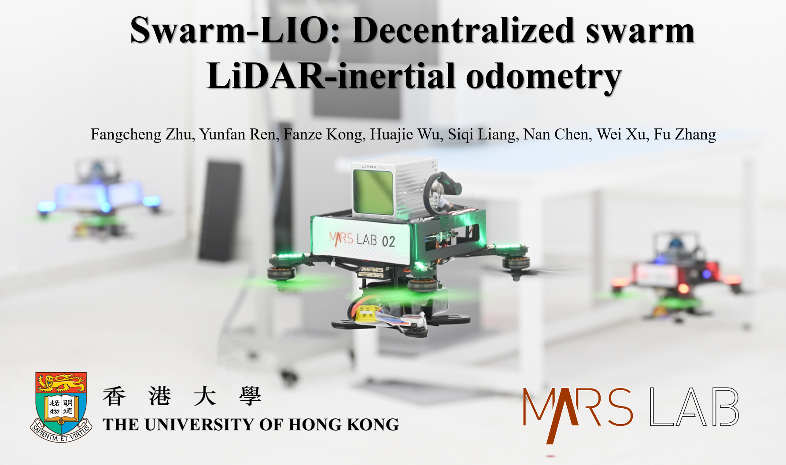
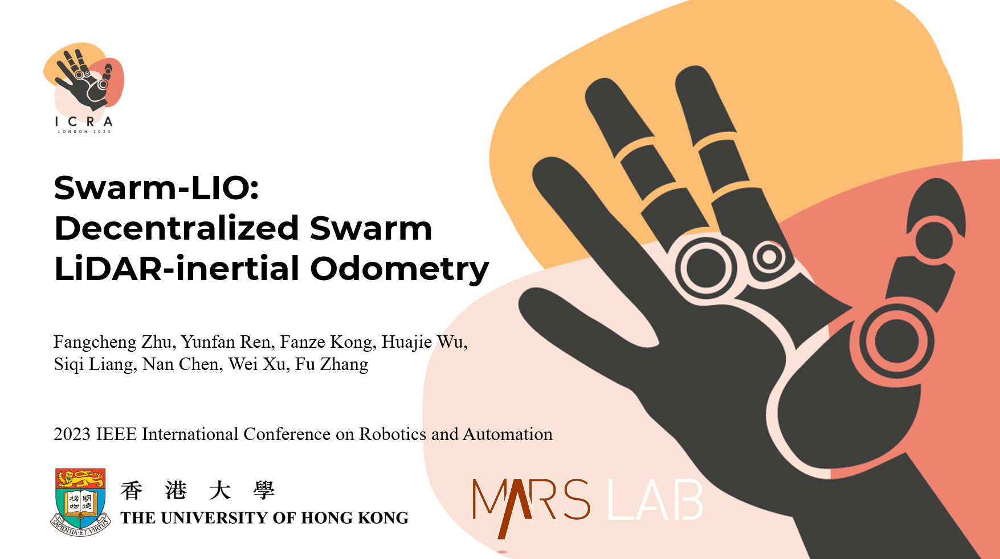

# Swarm-LIO2

## Introduction

**Swarm-LIO2** is a fully decentralized, plug-and-play, computationally efficient, and bandwidth-efficient LiDAR-inertial odometry for aerial swarm systems.

Our package address following key issues:

1. Robust, real-time, accurate **ego-state estimation** and **mutual state estimation**.
2. High quality **global extrinsic calibration**.
3. Superior computation and communication efficiency which **supports large swarm scales**.
4. Excellent **robustness in various scenarios:** indoor, outdoor, dark night, degenerate corridors...
5. Support **diverse UAV swarm applications**: target tracking, collaborative exploration, payload transportation...


## Improvements

**Swarm-LIO2** improves our previous work Swarm-LIO (see below) mainly in five crucial aspects:

1) **Fast Initialization**: factor graph optimization is utilized for efficient identification and global extrinsic calibration, which largely decreases the complexity and energy consumption of the swarm initialization.
2) **Efficient Computation**: novel marginalization and degeneration evaluation are presented to alleviate computation burden and to support large swarm scales.
3) **Detailed Modeling**: detailed measurement modeling and temporal compensation of the mutual observation measurements are proposed, which mitigates the approximation error when fusing data.
4) **Comprehensive Experiments**: more extensive experiments in both simulated and real-world environments are conducted, which demonstrate superior performances in terms of robustness, efficiency, and wide supportability to diverse aerial swarm applications.
5) **Open Source**: all the system designs will be open-sourced to contribute the robotic society.


## Code, paper, video

Code and paper are coming soon......

The accompanying video of **Swarm-LIO2** is available on [YouTube](https://youtu.be/NxHN0DlvvY4):

<div align="center">
    <a href="https://youtu.be/NxHN0DlvvY4" target="_blank">
    
</div>


## Previous Work: Swarm-LIO

Swarm-LIO is a fully decentralized state estimation method for aerial swarm systems, in which each drone performs precise ego-state estimation, exchanges ego-state and mutual observation information by wireless communication, and estimates relative state with respect to (w.r.t.) the rest of UAVs, all in real-time and only based on LiDAR-inertial measurements. 

### Related Paper

Our related papers are now available:  [Swarm-LIO: Decentralized Swarm LiDAR-inertial Odometry](https://ieeexplore.ieee.org/document/10161355)

Bibtex format:

```
@inproceedings{zhu2023swarm,
  title={Swarm-lio: Decentralized swarm lidar-inertial odometry},
  author={Zhu, Fangcheng and Ren, Yunfan and Kong, Fanze and Wu, Huajie and Liang, Siqi and Chen, Nan and Xu, Wei and Zhang, Fu},
  booktitle={2023 IEEE International Conference on Robotics and Automation (ICRA)},
  pages={3254--3260},
  year={2023},
  organization={IEEE}
}
```

### Related Video:

Our accompanying videos are now available on [**YouTube**](https://youtu.be/MxeoKVXrmEs?si=HaVMtdP-PhYm1kSe)  and **Bilibili** (click below images to open)

<div align="center">
    <a href="https://b23.tv/MnAbSVX" target="_blank">
    
      <a href="https://b23.tv/nGhNqVS" target="_blank">
    
</div>


